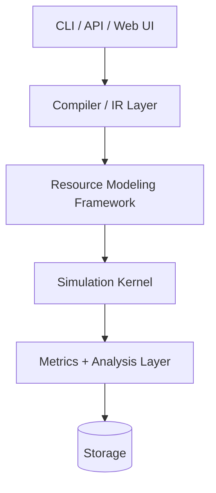

# Infra-Sim: High-Level Design

The low-level design is authoritative when implementation details differ from this document. This HLD should be updated whenever an LLD decision changes an architectural contract or MVP behavior.

## 1. Overall Architecture

Five logical layers keep the system modular and testable:



### Design rules

- Dependencies point downward only.
- The kernel is AWS-agnostic.
- The IR is intentionally generic and resource-type agnostic.
- AWS behavior is implemented in plugins and resource handlers.

## 2. Simulation Engine

### Core loop

```text
while event_queue not empty and clock < horizon:
    event = event_queue.pop_min()
    clock = event.time
    if event.type == POLICY_TICK:
        metrics_collector.sample(clock, world_state)
        event_queue.push(next_policy_tick)
        continue
    resource = world_state.get(event.target)
    new_events = resource.handle(event, context)
    for e in new_events:
        update_request_hop(e, from=event.target)
        e.causal_parent = event.id
        event_queue.push(e)
    metrics_collector.observe(event, world_state)
```

### Key design decisions

- Virtual clock is a single monotonic counter; no wall-clock reads.
- Event queue is a min-heap keyed by `(timestamp, sequence_number)`.
- Sequence numbers are assigned by the event queue when an event is pushed. Determinism therefore requires resource handlers to return follow-up events in a stable order and never construct that order by iterating over an unordered map.
- Every causal chain retains a `causal_parent` to support downstream failure reconstruction.
- `POLICY_TICK` is engine-native because it samples the whole world rather than targeting a resource. The engine seeds and self-reschedules it; resource handlers never receive it.
- The engine centrally updates `upstream` and `current_hop` whenever an event hands a request to a different resource. Queued requests therefore retain enough routing state to resume and reply correctly.

### Request lifecycle

Requests are modeled as state objects rather than threads or coroutines.

```text
RequestState {
  id,
  arrival_time,
  current_hop,
  path_history[],
  upstream,
  operation_type,
  retries_so_far,
  deadline,
  size_bytes
}
```

Typical flow:

```text
REQUEST_ARRIVED(ALB)
  -> ROUTING_DECISION
  -> REQUEST_ARRIVED(EC2)
  -> QUEUE_ENQUEUED
  -> SERVICE_STARTED
  -> SERVICE_COMPLETED
  -> DOWNSTREAM_CALL_STARTED(RDS)
  -> ...
  -> RESPONSE_SENT
```

### Concurrency and queueing

Each resource uses `ServerPool` or `ConnectionPool` abstractions to model capacity and waiting behavior.

```text
ServerPool {
  capacity: usize
  in_flight: usize
  queue: Deque<RequestState>
  queue_limit: Option<usize>
}
```

Backpressure, timeouts, and retries are all modeled as scheduled events, not separate subsystems.

For the MVP, compute capacity is one aggregate pool with `capacity = instances * workers_per_instance`. Per-instance queues and uneven load distribution are deferred; adding them changes compute-resource internals, not the kernel.

## 3. Infrastructure Intermediate Representation (IR)

The IR is the seam that keeps the simulation kernel independent from AWS specifics.

```text
IRGraph:
  nodes: [IRNode]
  edges: [IREdge]
  metadata: { source: "yaml" | "terraform" | "cdk", version: str }
```

```ts
interface IRNode {
  id: string;
  resourceType: string;
  parameters: Record<string, ParamValue>;
  scalingPolicy?: ScalingPolicyIR;
  failureProfile?: FailureProfileIR;
}

interface IREdge {
  from: string;
  to: string;
  protocol: string;
  parameters: Record<string, ParamValue>;
}

interface InfrastructureIR {
  nodes: IRNode[];
  edges: IREdge[];
  metadata: { source: string; version: string };
}
```

### Importing Terraform, CloudFormation, and CDK later

- Terraform: use `terraform show -json` or plan JSON and build a best-effort mapper.
- CloudFormation: parse the `Resources` block and infer edges from `DependsOn`, `Ref`, and `GetAtt`.
- CDK: synth to CloudFormation first, then reuse the CFN importer.

This work is intentionally deferred beyond MVP.

## 4. Resource Modeling Framework

A generic base abstraction keeps the engine independent from AWS service types.

```ts
interface SimResource {
  id: ResourceId;
  type: string;
  handleEvent(event: SimEvent, ctx: SimContext): SimEvent[];
  snapshotMetrics(): ResourceMetricsSnapshot;
  applyFailure(failure: FailureEvent): void;
  clearFailure(failure: FailureEvent): void;
}
```

The MVP interface does not include autoscaling. A scaling capability will be added in Phase 4 when its event handlers and lifecycle are designed, rather than requiring every initial resource to expose an unused method.

### Shared building blocks

- `ServerPool`
- `ConnectionPool`
- `Distribution`

### Registry model

```text
ResourceRegistry.register('compute', (params) => new ComputeResource(params));
ResourceRegistry.register('database', (params) => new DatabaseResource(params));
```

The registry is keyed by generic simulation classes, not AWS service names. A separate service-profile catalog resolves names such as `aws.ec2`, `aws.ecs`, and `aws.rds.postgres` into a generic class plus defaults before registry lookup. This allows multiple AWS services to reuse the same behavior without duplicating resource implementations and provides display metadata for a future visualizer.

World construction is two-pass: reserve dense `ResourceID` slots for every IR node, then resolve edges and construct resources into those slots. This makes downstream IDs available regardless of node declaration order while preserving O(1) array-indexed dispatch.

## 5. Workload Generator

A workload generator produces `REQUEST_ARRIVED` or `MESSAGE_PRODUCED` events from the current virtual time.

```ts
interface WorkloadGenerator {
  nextArrival(after: SimTime, workloadRng: RNG): SimTime | null;
}
```

The load-generator resource creates the `RequestState` and schedules one arrival at a time. Workload implementations are responsible only for deterministically producing the next arrival time. A `CompositeGenerator` chains an ordered list of constant or ramp segments using one continuous workload RNG stream.

### Supported workload models

- MVP: constant / Poisson and ramp segments
- Later: spike, burst, periodic / seasonal, custom trace replay, and async event-driven messages

MVP workload segments must be ordered and exactly contiguous: each segment's end time equals the next segment's start time. Gaps and overlaps are rejected because one load generator owns the arrival stream.

Read-heavy and write-heavy behavior should be modeled as request metadata rather than separate generator families.

## 6. Metrics System

The metrics system must stream aggregate values, not store every event forever.

```ts
interface MetricsSink {
  onEvent(event: SimEvent, worldState: WorldState): void;
  onTick(time: u64): void;
}
```

### Metrics types

- Throughput over fixed time buckets
- Latency histograms for p50/p95/p99
- Utilization samples at tick boundaries
- Error, drop, retry, and queue saturation counters
- Consumer lag where relevant

Use a bounded raw-event ring buffer for debugging. Keep the default behavior aggregated and compact.

The sink is initialized with an entry for every resource during bootstrap. A one-second engine-native `POLICY_TICK` samples utilization and queue depth. Global throughput used for plateau detection is measured at the ALB entry point, the single request funnel, rather than inferred from an arbitrary resource.

## 7. Bottleneck Analysis

The naive “resource with highest utilization wins” heuristic is not sufficient.

### Better method

1. Detect the throughput plateau.
2. Find resources that are actually queueing or blocking.
3. Trace causal chain through `causal_parent` relationships.
4. Report ranked bottlenecks with reasoning rather than a single opaque number.

Example output:

```text
Throughput plateaued at 46k RPS because:

Primary bottleneck: RDS connection pool
Secondary: EC2 CPU, largely a symptom of retry traffic
Not a bottleneck: ALB
```

## 8. Cascading Failure Modeling

Cascades should emerge naturally from the event graph rather than being engineered as a special subsystem.

### Required ingredients

- Failure injection as scheduled state mutation events
- Correct resource degradation logic
- Retry-generated load tracked separately from organic load
- Group-based selectors for AZ and broker-level failures

A DB slowdown can naturally propagate as:

```text
DB slower
-> connections held longer
-> pool exhaustion
-> compute queue growth
-> timeouts
-> retries
-> traffic amplification
```

## 9. Autoscaling

Autoscaling is also a first-class scheduled event model.

```ts
interface ScalingPolicy {
  metric: 'cpu' | 'queueDepth' | 'connectionUtilization' | ...;
  scaleUpThreshold: number;
  scaleUpSustainedFor: Duration;
  scaleUpDelay: Duration;
  scaleDownThreshold: number;
  scaleDownSustainedFor: Duration;
  scaleDownDelay: Duration;
  minInstances: number;
  maxInstances: number;
  stepSize: number;
}
```

The key is that provisioning delay is modeled as an interval rather than pretending capacity appears instantly.

## 10. Parallelism and Performance

Start single-threaded.

### Why

- Single-threaded DES is simpler, deterministic, and fast enough for the expected workload.
- Conservative or optimistic PDES adds synchronization complexity and non-determinism risk.
- Multi-run parallelism is a better fit than single-run parallelism for scenario sweeps.

### Practical performance levers

- Event batching for very high-rate uniform traffic
- Metrics aggregation instead of raw logging
- Sampling for long low-fidelity runs

## 11. Deterministic Reproducibility

This is a non-negotiable property.

### Must-haves

- One global master seed per run
- Separate sub-streams for workload, service-time, and failure injection
- Every run has a `simulationId` derived from the graph, workload, seed, and engine version
- Event ordering strictly follows `(time, seq)`, with `seq` assigned by the queue at push time
- Failures are deterministic under a fixed seed

## 12. Calibration

Calibration is the hardest non-engineering challenge in the project.

### Priority order

```text
default parameters
  -> AWS-derived limits
  -> user benchmark overrides
  -> production calibration data
```

Each parameter should carry provenance.

```ts
interface CalibratedParam<T> {
  value: T;
  source: "default" | "aws_docs" | "user_benchmark" | "production";
  confidence: "low" | "medium" | "high";
}
```

### Practical strategy

- Generic defaults are reasonable placeholders.
- AWS documentation gives good limits.
- User benchmark calibration is the most actionable pathway for trustworthy simulation.
- Production data ingestion is a later phase.

## 13. Confidence Levels

Confidence is a rollup of the provenance of parameters on the causal path to the result.

A derived result is only as confident as its weakest dependency.

```text
result.confidence = min(confidence of all relevant parameters)
```

The UI should explain why a result is low, medium, or high confidence.

## 14. Cost Modeling

Cost estimation is a post-processing function over the run trace, not a core simulation concern.

```ts
interface CostModel {
  estimate(runTrace: RunMetrics, pricingTable: PricingTable): CostEstimate;
}
```

This stays decoupled from the kernel and reads the same aggregated resource data already collected during the run.

## 15. Storage

For v1, a file-based model is enough.

### Persisted

- Architecture definitions
- Simulation configs
- Aggregated results
- Calibration profiles

### Not persisted for v1

- Live event queue state
- Full raw event traces beyond a small bounded debug window

A flat directory of versioned JSON blobs is enough for early product needs.

## 16. APIs and CLI

### Core interfaces

```ts
compile(source: YamlSource): InfrastructureIR
runSimulation(ir: InfrastructureIR, workload: WorkloadConfig, options: RunOptions): RunResult
analyzeBottlenecks(result: RunResult): BottleneckReport
estimateCost(result: RunResult, pricing: PricingTable): CostEstimate
saveRun(result: RunResult): SimulationId
loadRun(id: SimulationId): RunResult
```

For the Go MVP, assembly is centralized in `engine.Bootstrap(graph, workloadConfig, failureConfig, seed)`. Bootstrap builds the world, creates deterministic RNG streams and the metrics sink, seeds the load-generator tick, metrics tick, and failures, and defaults the simulation horizon to the final workload segment's end time. The kernel's `RunTrace` contains deterministic execution facts such as event count and final time; aggregated metrics remain in the engine-owned sink and are passed separately to analysis.

### Example CLI flow

```bash
infra-sim validate architecture.yaml
infra-sim run architecture.yaml --traffic 50000 --duration 30m --seed 42 --out results/run-001.json
infra-sim report results/run-001.json --bottlenecks --cost
infra-sim compare architecture-a.yaml architecture-b.yaml --traffic 20000 --duration 10m
```

## 17. Technology Choices

### Simulation engine

Go is the recommended choice.

Why:

- fast enough for this workload
- easy iteration speed
- great standard library for heap/event queue work
- simple CLI deployment
- natural fit for parallel scenario sweeps later

### CLI

Keep the CLI and engine in the same Go binary.

### Backend / API

Use Go for most early work. If calibration and statistical fitting become dominant, Python can be used for offline calibration tooling while the core engine remains Go.

### Frontend

TypeScript + React is the correct later-stage choice for architecture editing and dashboards.

## 18. MVP

### Architecture

```text
Load Generator -> Load Balancer -> Compute -> Database
```

### Initial resource types

1. LoadGenerator
2. LoadBalancer
3. ComputeResource
4. DatabaseResource

### Included in MVP

- Ordered, contiguous constant and ramp workload segments
- Throughput, latency histogram, utilization, queue depth, error/drop rate
- Plateau-based bottleneck detection
- Fixed-time DB latency injection failure
- YAML-to-engine bootstrap wiring
- DAG validation with exactly one load-generator node
- Browser architecture studio for node/edge editing, resource parameters, workload phases, failure injection, validation, simulation, and result visualization
- Go JSON API for service-catalog discovery, validation, YAML import, and asynchronous simulation jobs
- Live virtual-time progress, resource pressure snapshots, cancellation, bounded concurrency, and web-run safety limits

### Explicitly excluded from MVP

- Autoscaling
- Retries and timeouts
- Kafka/SQS/Redis
- Read replicas
- Cost modeling
- Terraform/CFN import
- Persistent projects, authentication, collaboration, and hosted multi-user UI
- Per-instance compute queues and hot-instance modeling

## 19. Development Roadmap

### Phase 1: Simulation Kernel

Goal: validate the event loop, virtual clock, queueing primitives, and a synthetic toy resource model.

### Phase 2: Generic Resources + MVP AWS Profiles

Goal: implement the load balancer, compute resource, database resource, and plateau bottleneck analysis.

### Phase 3: Broader AWS Resource Profiles

Goal: add Redis, SQS, Kafka, read replicas, and more workloads without modifying the kernel.

### Phase 4: Failures, Retries, Autoscaling

Goal: prove cascading failure behavior and implement retry storms and autoscaling delays.

### Phase 5: Terraform / CFN / CDK Import

Goal: convert infrastructure definitions into the IR graph.

### Phase 6: Visualization / Web UI

Status: the initial browser architecture editor and simulation dashboard are implemented as a React/TypeScript application backed by the Go API. Future Phase 6 work covers persistence, richer charts, import/export, comparison views, collaboration, and hosted operation.

The service-profile catalog is the backend source for the visualizer palette. It exposes stable AWS type, icon, label, and category metadata; the visualizer emits the same IR shape as YAML and uses the same validation, world-building, and simulation path. Requiring no kernel or resource-class changes is a Phase 6 acceptance criterion.

### Phase 7: Calibration from Production Metrics

Goal: align resource parameters against real-world benchmark and CloudWatch data.

## 20. Difficult Technical Problems

The main risk areas are:

1. Service-time distributions, not means
2. Correlated failures / shared fate
3. Retry storms diverging or converging unrealistically
4. Multiple concurrently saturated resources
5. Calibration scarcity for latency parameters
6. Determinism across platforms and compilers

## 21. Example Simulation Walkthrough

Architecture:

```text
Load Generator -> ALB -> EC2 x 4 -> RDS PostgreSQL
```

Traffic:

```text
0–60s: 5,000 RPS
60–180s: ramp 5,000 -> 50,000 RPS
180–300s: 50,000 RPS constant
```

Conceptually, the system transitions from low steady state into a DB connection pool saturation regime, where queue depth grows, p99 latency spreads, and bottleneck detection identifies the DB pool as the primary constraint rather than EC2 CPU.

The three phases are represented as contiguous workload segments. `EC2 x 4` is modeled in the MVP as a single aggregate compute pool whose capacity is four times `workers_per_instance`, not as four independently queued instances. By default the run horizon is 300 seconds, the end of the last workload segment.

The final report should explain the cause and the confidence level rather than presenting a single misleading number without caveats.

## Summary

Infra-Sim should be designed as a deterministic DES engine with a generic infrastructure IR, AWS-specific resource plugins, strong provenance and confidence tracking, and a disciplined MVP that proves the architecture before adding retries, autoscaling, or importers.

The product is valuable not because it can emulate AWS perfectly, but because it makes bottlenecks, failure cascades, and operating tradeoffs visible in a reproducible and explainable way.
